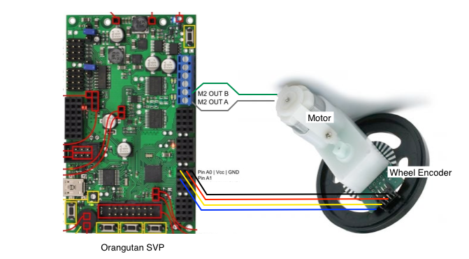
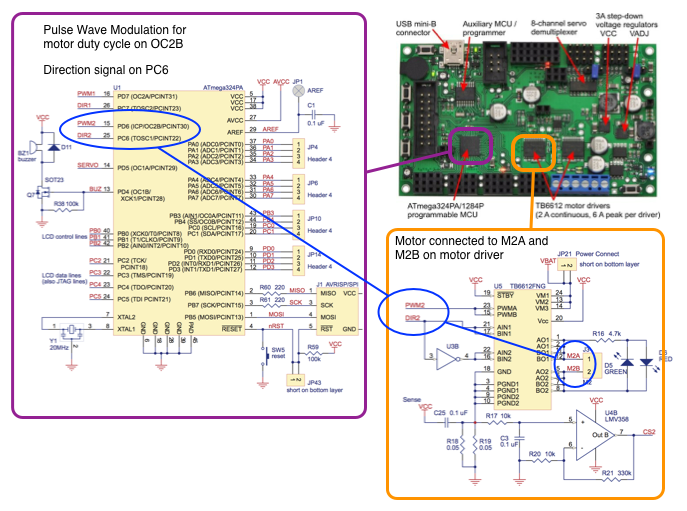

Lab Assignment 3 : PD Motor Control
===================================
Due : Sunday-ish, April 13th-ish
Submit electronically via email or repo
 
Introduction
------------
For this lab, you will implement two motor controllers using PD control. For positional control, the motor should reach any referenced motor position without significant oscillation. For speed control, the motor should obtain a sustained reference speed. Your goal is to find appropriate values for the gains Kd and Kp in the PD equation. In addition, you will develop an interpolator that can follow a positional trajectory (i.e. can reach a series of goal positions).

Your system will be composed of the following parts:

* A PD controller
* A linear trajectory interpolator
* A user interface

PD Controller
-------------
The PD controller maintains either the position or speed of the motor using the measured and reference positions of each. It is of the highest priority in the system. The frequency of the controller task should be slightly higher than the desired sampling rate of the encoder readings, which will provide a measure of both position and speed. The positional controller that you will implement calculates a desired torque according to the equation

    T = Kp(Pr - Pm) - Kd*Vm 
	
	where
    	T = Output motor signal (torque)
    	Pr = Desired motor position or speed
    	Pm = Current motor position or speed
    	Vm = Current motor velocity (computed based on finite differences)
    	Kp = Proportional gain
    	Kd = Derivative gain

and the speed controller calculates desired torque according to the equation

    T = Kp(Vr - Vm) + Kd( d (Vr-Vm) / dt )

T is a signal that can be used directly to control the motor, except check that it is in range { -TOP, TOP}, and use absolute(T) and set motor direction appropriately. You should always be generating motor commands, regardless of whether the reference position is changing or not. This means that at any time, if you move the wheel manually when controlling position, the PD controller should bring it back to the current reference position. In other words, even if the motor is where it should be, do not stop sending commands to the motor, instead send it 0 (or whatever torque value your controller produces).

Pm and Vm can be computed using the encoder attached to the motor. The encoder generates a pair of signals as the motor shaft rotates, which are used as input signals into 2 general I/O port pins on the Orangutan. Using the Orangutan libraries (the wheel encoder example) or your own code, set up pin change interrupts on these port pins and count the number of signal changes to track the position of the motor.

Pr is provided through the user interface or as part of a hard-coded trajectory.

Kp and Kd are the terms that you define that determine how your system behaves. You will need to determine these values experimentally. 

To get started with finding your Kp and Kd, think about the equation:

    T = Kp(Pr - Pm) - Kd*Vm

Your torque value needs to be in the range -TOP to TOP as you defined it in setting up your PWM (Note: you don't feed negative values to your motor, instead set the direction to reverse and give it a positive torque value). Consider the point when the motor is first starting to move (Vm is 0), if you want T to be close to TOP at this point (although you might want to start at about TOP/2 to see how it goes), then Kp is your only unknown and you can start with it there. With this value, it is likely that your motor will be oscillating around its reference position (overshooting). The Kd term helps with this, so start adding that in to see if you can get rid of it (at least most of it). Test your gains with reference positions both very close and very far from its current position.

Motor
-----
The motor is attached to the Motor2 port of the Orangutan. This corresponds to OC2B for the PWM drive signal and PC6 as the directional signal. You should write your own code to control the motor, but you may use the Orangutan code as reference material. You use the torque value generated from the controller to adjust the duty cycle of the waveform, thus the speed of the motor. The motors we are using are Solarbotics Gear Motor 2 motors, and the encoders are Solarbotics Wheel Watcher Rotation Encoders. These items can be found at the following websites: http://www.solarbotics.com/products/gm2/ http://www.solarbotics.com/products/gmww02/

Trajectory Interpolator
-----------------------
For this lab, the interpolator will be used with positional control and serves the purpose of managing the reference (desired) position and feeding it to the PD controller to execute a complete trajectory (e.g. rotate forward 360 deg, rotate backwards 90 deg, rotate forward 10 deg).

User Interface
--------------
The user interface consists of the following commands at a minimum (feel free to add in whatever makes your life easier for programming and debugging):

    L/l: Start/Stop Logging (print) the values of Pr, Pm, and T.
    V/v: View the current values Kd, Kp, Vm, Pr, Pm, and T
    R/r : Set the reference position (use unit "counts")
    S/s : Set the reference speed (use unit "counts"/sec)
    P: Increase Kp by an amount of your choice*
    p: Decrease Kp by an amount of your choice
    D: Increase Kd by an amount of your choice
    d: Decrease Kd by an amount of your choice
    t: Execute trajectory
	  
	* The amount to increase or decrease the gain by depends on how you set up the PWM channel

Deliverables
------------
See [the report](REPORT.md "Report") for deliverables.

-----

Implementation Notes
--------------------
The motor we will be using is connected to M2 A and B on the Orangutan SVP board. The wheel encoder is a separate board attached to the motor that reads the rotation of the wheel and sends signals back to the Orangutan. 

As you can see, I have decided to connect the wheel encoder signal lines to Pin A0 and Pin A1. An entire rotation of the wheel will result in 128 "counts" to be registered by the encoder. The signals that come in on these pins are triggered from the external sensor events, so they happen when they happen and there is no polling frequency or other scheduling to be done.

The motor will be controlled by pulse wave modulation on Pin D6 that is generated by the output compare wave generator OC2B. The direction of the motor is controlled by a signal on Pin C6. These signals are sent to the motor driver chip which translates the signals to voltages on M2A and M2B that are connected to the motor.

